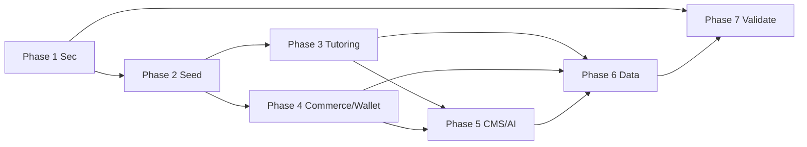

# Starlite — Implementation Plan

> Step-by-step migration from the audited current state to the Target Architecture.
> Companion docs: `CODEBASE_AUDIT.md`, `TARGET_ARCHITECTURE.md`.
> Guideline order: secure first, organize second, stabilize third, harden fourth.

> **Phase 1 (Security) status:** DONE — branch `security/fix-critical-secrets-auth`.
> Completed: secrets removal & `.env.example` templates; AI `/api/v1/ask` Bearer-token auth (+pytest); removed blanket SSL verify disable; removed `SET FOREIGN_KEY_CHECKS=0`; Paystack secret server-side only + payment tied to order metadata + idempotency guard in `paymentSuccess`; rate limits on web login/auth, API auth, payment prep and Payfast webhook; IDOR fixes (profile read, education/experience/certificate destroy); configurable Sanctum token expiry; Courses API gated on module-enabled; CI workflow (Laravel + FastAPI).
> Manual follow-ups REQUIRED: **rotate all exposed credentials** (DB/Redis/mail/OpenAI/Stripe/SMTP) and optionally purge git history (BFG/filter-repo). 1.9 (runtime `.env` writes) still open — deferred as a medium behavioural refactor.

---

## 0. Guiding Constraints

- **Do not break the running platform** — each phase ships in deployable increments.
- **Keep the domain/model schema intact** throughout; only add, never destructive-remove, migrations until Phase 6.
- **No hot rewrites.** Strangler-fig pattern: new domain modules coexist with old `app/Services` behind thin facades.
- Every phase ends with: green test suite (existing + new), `pint --test`, no console warnings.
- Regular `git mv`/refactor commits, never combined feature+refactor commits.

---

## Phase 1 — Security & Hygiene (highest priority, do first)

**Goal:** Remove exposed secrets, lock the AI service, remove SSL bluster, establish CI.

| Task | Detail | Deliverable |
|---|---|---|
| 1.1 | `git rm --cached .env ai_assistant/.env`; add `.gitignore` entries; encrypt/rotate all real credentials (mail, DB, OpenAI, Stripe, service keys). | Clean tree, no secrets in history reachable from `main` (optionally `filter-branch`/BFG if history must be purged) |
| 1.2 | Create `.env.example` mirroring all env keys (incl. `AI_SERVICE_URL`, `CHROME_PATH`, gateway keys). | Env documentation |
| 1.3 | AI assistant auth: require `Authorization: Bearer <service-token>`; validate principal claim (student_id + token) server-side; drop body-trust of `student_id`. Add `AI_SERVICE_TOKEN` env to Laravel and ai_assistant. | `POST /api/v1/ask` returns 401 without valid claim |
| 1.4 | Remove blanket `CURLOPT_SSL_VERIFYPEER=false`; drop `certs/` hacks; rely on system CA bundle. Add `verify` option to outgoing cURL/SDK calls. | No SSL disable path except explicit `ssl-mode` in dev |
| 1.5 | Replace `DB::statement('SET FOREIGN_KEY_CHECKS=0')` in `rescheduleSession` with FK-safe ordering (delete children before parent, or soft-close + reassign). | No FK bypass |
| 1.6 | Add rate limiting to `/api/v1/login`, `/social-login`, `/register`, `/forget-password` (throttle middleware `throttle:login`). | Abuse resistance |
| 1.7 | Gate module API routes on module enable status (wrap module api route groups with `enabled:` middleware). `bootstrap/app.php` route glob already loads files; add a guard middleware reading `modules_statuses.json`. | Disabled module = no API surface |
| 1.8 | Wire CI: GitHub Actions (or pint/phpstan/test on push+PR). Include `--test` for Pint, `phpstan analyse app/Domain`, `php artisan test`. | CI config file |
| 1.9 | Remove `.env` parse/mutation from `GeneralController::$envPath`-style flows (runtime env writes) → move such settings to optionbuilder-settings or config files. | No runtime `.env` edits |
| 1.10 | Rotate Sanctum token expiry from 7d to a configurable value; record token fingerprint for revocation on logout (already logged). | Revocable tokens |

**Exit criteria:** no secrets in `git ls-files`; AI endpoint requires auth; API throttled; CI green; SSL hook removal compiles.

---

## Phase 2 — Domain Seed & Principal Context

**Goal:** Establish the target directory skeleton, move shared infrastructure first.

| Task | Detail |
|---|---|
| 2.1 | Create `app/Domain/{Identity,Tutoring,Courses,Bundles,Commerce,Wallet,CMS,Notifications,Messaging,Ai,Shared,Principal,ModuleRegistry}` directories with `composer.json` PSR-4 autoload `App\Domain\*` (or keep single `App` namespace, folder-only conveniences). |
| 2.2 | Implement `Principal` value object + `PrincipalResolver` (web session role legacy-compat, API Sanctum claims, queue payload). |
| 2.3 | Deprecate `User::role` accessor: add `PrincipalAware` trait so services optionally carry a `Principal`; log any `Session::get` call sites found via grep for `active_role_id`. |
| 2.4 | Move shared helpers to classes: `Shared\TimeZone` (`parseToUTC/parseToUserTz`), `Shared\Currency`, `Shared\Storage` (`getStorageDisk`), `Shared\FileUpload`, `Shared\Guid`. Update `helpers.php` to thin delegators (kept for BC). |
| 2.5 | `ModuleRegistry` capability map in `config/module-capabilities.php`; `NoOpProvider` default; migrate `Module::has('X')` call sites in `BookingService`, `SiteService`, `OrderService`, `Course` model to registry queries only. |
| 2.6 | `SettingReader` abstraction: typed DTO hydration from optionbuilder cache; invalidate via existing `SettingsUpdated` listener. |
| 2.7 | Create `docs/ARCHITECTURE.md` with golden-rule checklist (new code touches domains & adapters only). |

**Exit criteria:** new dirs exist, `principal` resolves on web+API+queue, no new `Module::has` calls, helpers still pass existing tests.

---

## Phase 3 — Tutoring Domain Extraction (biggest refactor)

**Goal:** Split `BookingService` (1,203 ln) into bounded actions.

| Task | Detail |
|---|---|
| 3.1 | Write characterization tests first: capture current behavior of `addUserSubjectGroupSessions`, `addTimeSlots`, `reservedBookingSlot`, `createBooking`, `rescheduleSession`, free-purchase paths, calendar/meeting effects. Use transactional DB tests with factories. |
| 3.2 | Extract `SlotRepository` (slot generation & queries currently in BookingService). |
| 3.3 | Extract `BookingService` orchestration → `Tutoring\Actions\` (`CreateBooking`, `RescheduleBooking`, `CancelBooking`, `CompleteBooking`) each with a command DTO + events. |
| 3.4 | Extract `ReservationService` (reservation + auto-expiry `RemoveBookingReservationJob` behavior — keep job, move logic). |
| 3.5 | Extract `FreeAccessService` (free-slot booking, free-course and free-bundle enrollment paths). |
| 3.6 | Extract `MeetingLinker` (Zoom/GoogleMeet + `CreateGoogleCalendarEventJob` integration) — keep `MeetFusion` drivers. |
| 3.7 | Move `reviews`,`disputes`,`favourites` paths into `Tutoring\Review` / `Tutoring\Dispute` / `Tutoring\Favourites` small services. |
| 3.8 | Move wallet/payout commission math to `Wallet/PayoutService` (currently entangled in booking flow). |
| 3.9 | `app/Services/BookingService` becomes a thin facade calling new domain entries; mark `@deprecated`. |
| 3.10 | New unit tests per action (positive + boundary + authorization). |

**Exit criteria:** `app/Services/BookingService` < 200 ln facades; all features green; performance parity (same SQL counts on booking/cart pages).

---

## Phase 4 — Commerce, Wallet & Course/Bundle Domains

**Goal:** Order flow and course/bundle logic in their contexts.

| Task | Detail |
|---|---|
| 4.1 | `Domain/Commerce`: `CartService` session read refactor → `CartRepository` (session-backed, testable); `OrderService` → `OrderingAction` + `InvoiceGenerator` (DomPDF/Browsershot); coupon logic behind `CouponEngine` interface (kupondeal provider or default NoOp). |
| 4.2 | `Domain/Commerce`: move `storeOrderItems` polymorphic mapping into an explicit `OrderItemHydrator` with tests for orderable morphs. |
| 4.3 | `Domain/Wallet`: refactor `WalletService` (add/deduct/get/refund) to ledger actions; preserve existing logic & tests. Move commission split logic (platform fee, tutor wallet credit). |
| 4.4 | `Domain/Courses`: slim `CourseService` — split into `CourseQuery` (catalog/search/filter), `CourseEditor` (CRUD wizard), `Enrollment`, `Watchtime`, `Discussion`. Keep module Livewire as coordinator. |
| 4.5 | `Domain/Bundles`: same slimming for `BundleService` — `BundleQuery`, `BundleEditor`, `BundlePurchase` (computed `final_price` column preserved). |
| 4.6 | Move API controllers to call domain actions with command DTOs (not services-with-side-effects); keep response envelope via `ApiResponser`. |
| 4.7 | Add tests: cart add/remove, order creation, coupon application, wallet fan-out on purchase, enrollments, watchtime progress, bundle final_price. |

**Exit criteria:** order placement runs entirely through domain actions; wallet math covered; API v1 contract unchanged.

---

## Phase 5 — CMS, Notifications, Messaging & AI

**Goal:** Remove remaining god-classes and lock side effects.

| Task | Detail |
|---|---|
| 5.1 | `PageBuilderService` (1,922 ln): split into `PageRenderer` (section stack), `SectionEditor` (admin), `MediaResolver`; content storage untouched. |
| 5.2 | Notifications: `NotificationBus` + template registry; `NotificationService` (586 ln) becomes dispatcher factory; `DbNotificationService` becomes the in-app sink. All `NotificationService::sendSiteSpecificNotification`-style calls route through the bus. |
| 5.3 | Messaging: wrap LaraGuppy behind `Domain/Messaging/Messenger` facade (unchanged package internals). |
| 5.4 | AI: wire widget to `AI_SERVICE_URL`/`AI_SERVICE_TOKEN` (no hard-coded 127.0.0.1); add Laravel-side timeout + error fallback UI; ai_assistant tests (FastAPI TestClient) for auth, rate-limit, unknown-student, empty-faq. |
| 5.5 | Remove blog remnants (models/views/routes referencing Blog/BlogCategory/BlogTag) after confirming no referenced routes; update seeders accordingly. |
| 5.6 | Remove `TaxonomyService` (empty), unused `UsersExport`, `resources/views/pages` (Volt mount), dead comments, `getOrdeWrWithItem`. |
| 5.7 | Dedup currency data: `helpers.php` currency list → `config/currencies.php` only; `currencyList()` reads config. |

**Exit criteria:** no >500-line service in `app/Services` or `Modules/*/Services` (except legacy facades pending removal); page render & notifications green; AI widget uses env URL; blog code gone.

---

## Phase 6 — Data Hygiene & Final Lockdown

**Goal:** Schema stability, performance, retirement of deprecated facades.

| Task | Detail |
|---|---|
| 6.1 | Add ALTER-only migrations: index pass for polymorphic columns (`*_type`, `*_id`) used in dashboards; `options->subject` JSON extraction into real column (e.g. `subject_id`) with backfill; `slot_bookings` FK re-assertion (keep nullability documented). |
| 6.2 | Rename legacy `app/Services` facades → `@deprecated` and delete after all call sites migrated (grep audit shows `new BookingService` etc.). Remove `getOrdeWrWithItem`. |
| 6.3 | Standardize remaining raw queries → repositories with tests. |
| 6.4 | Queue/infra: wire `RedisQueue` + `QUEUE_HEARTBEAT` job wiring; verify Reverb config or remove if unused; add `kernel::schedule` for reservation expiry + heartbeat. |
| 6.5 | Performance: N+1 pass on tutor search, dashboard insights, course-taking; add `->with()` and/or sparse-field responses; verify indexes on `courses_*` join columns. |
| 6.6 | Final `php artisan test` full suite + `phpstan` level target; open a release checklist doc. |

**Exit criteria:** full suite green in CI; no deprecated service instantiated; schema migrations apply cleanly from a fresh DB; `queue:listen` healthy.

---

## Phase 7 — Validate & Launch Toolkit

**Goal:** Documentation, observability, and gradual release.

| Task | Detail |
|---|---|
| 7.1 | Generate API reference (OpenAPI from routes + `ApiResponser` envelope) as `docs/api-reference/`. |
| 7.2 | Add structured logging (`Log::channel('domain')->info` on domain actions); add `metrics` for booking/reservation/payment counts. |
| 7.3 | Seed demo + test fixtures (`database/seeders/DemoDataSeeder`) used by CI and QA. |
| 7.4 | Run a regression sweep: tutor signup→slot→booking→payment→wallet→payout→review→course/bundle enroll→certificate; capture outputs in `docs/REGRESSION_REPORT.md`. |
| 7.5 | Governance board: ADR log at `docs/adr/`, keep `ARCHITECTURE.md` checklist enforced in PR templates. |

---

## Risk Register

| Risk | Likelihood | Impact | Mitigation |
|---|---|---|---|
| Feature regression during BookingService split | High | High | Characterization tests first; facade keeps old callers; beta flag routes to new path |
| Message/broadcast breakage | Med | Med | Keep LaraGuppy package untouched until Phase 5.3; event-driven facade |
| API client drift (mobile) | Med | Med | Freeze `/api/v1` contract; add contract snapshot test in 4.x |
| Payment webhook regressions | Med | High | Contract tests with recorded Stripe/Paystack payloads; don't touch drivers until Phase 4.3 |
| AI assistant availability in prod | Med | Med | Sidecar deployment + env base URL; graceful fallback in widget |
| Schema/index drift | Med | Med | ALTER-only migrations in Phase 6 with backfill jobs |
| Team context loss | High | Med | This doc + ADRs + characterization tests as living spec |

---

## Cost Estimate (relative)

| Phase | Effort | Parallelizable |
|---|---|---|
| 1 Security & Hygiene | 2–4 dev-days | Yes (independent) |
| 2 Domain Seed & Principal | 3–5 dev-days | Low (blocked by 1) |
| 3 Tutoring domain | 2–3 weeks | Partial (actions within domain) |
| 4 Commerce/Wallet/Courses | 2–3 weeks | Partial across 4.1–4.7 |
| 5 CMS/Notifications/AI/cleanup | 1–2 weeks | Yes (per task) |
| 6 Data hygiene & lockdown | 1–2 weeks | Low (needs 3–5) |
| 7 Validate & launch toolkit | 1 week | Yes |

Total ≈ **8–12 weeks for one senior dev**, or **6–8 weeks with 2 devs** given parallelizability of Phases 1→5.

---

## Dependencies / Ordering Constraints

- P1 must precede everything (security).
- P2 precedes P3/P4 (context/principal scaffolding).
- P3 and P4 are independent after P2 → parallel.
- P5 partially depends on P3 (notification wiring) and P4 (wallet UI); titles are trade-able.
- P6 is blocked on P3–P5 (schema and facade removals).
- P7 runs last, continuously integrating.

---

*End of implementation plan. Ready for execution approval.*
