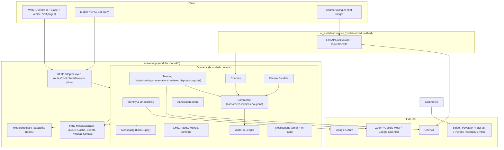

# Starlite — Target Architecture

> Forward-looking architecture for the "redo" of the Starlite monolith.
> Companion docs: `CODEBASE_AUDIT.md` (current state), `IMPLEMENTATION_PLAN.md` (how we get there).
> Date: 2026-09-22

---

## 1. Design Principles

1. **Bounded contexts over layers.** Organize code by business domain (Tutoring, Courses, Bundles, Commerce, Wallet, Identity, CMS, Notifications, Messaging, AI), not by technical layer. `app/Http/Controllers` → `app/Domain/<Domain>/`.
2. **Preserve the working domain model.** The polymorphic `orderable`/`mediable`/`ratingable`/`likeable` morphs, the two-stage wallet ledger, and the reservation lifecycle are proven. Keep the schema; change the organization around it.
3. **Thin adapters at the edge.** Controllers, Livewire components, CLI commands, and API routes are adapters. All business rules live in domain services invoked via explicit, dependency-injected service classes (constructor injection — no `new Service()` inside other services).
4. **Explicit role/tenant context.** Replace the session-read `User::role` accessor with an explicit `Principal` value object (web session, API sanctum, or queue worker context) passed (or resolved) per request. No hidden globals.
5. **Settings become typed config.** `setting('_group.key')` string lookups are replaced with typed `Settings` DTOs per domain, backed by the same optionbuilder tables during migration, then by config/cache with a flush-on-change listener that already exists (`SettingsUpdated`).
6. **Add-on capability registry.** Replace scattered `Module::has('quiz')` / `isActiveModule('upcertify')` calls in core services with a single `ModuleRegistry` (capability → provider resolution), so core domains never know module names.
7. **AI assistant is a product-facing service, not a backdoor.** AuthN via Sanctum token with a signed `student_id` claim; no reliance on request body identity; deployable as a containerized sidecar with configurable base URL.
8. **Tests are part of the build.** Every domain ships a test suite; CI gates merges.
9. **Incremental strangler-fig migration.** Domain blocks move one at a time; the app stays green at every commit.

---

## 2. Target High-Level Topology



---

## 3. Domain Decomposition (Target Directory Layout)

### 3.1 Monorepo layout

```
app/
  Domain/
    Identity/            # users, profiles, countries, social-auth, registration, verification
    Tutoring/            # subject groups, slots, bookings, reservations, reviews, disputes
    Courses/             # thin host over Modules/Courses (or migrated copy)
    Bundles/             # thin host over Modules/CourseBundles
    Commerce/            # cart, orders, order_items, invoices, coupons (kupon logic)
    Wallet/              # wallet, ledger, payouts, withdrawals, commission
    CMS/                 # pages, menus, breadcrumbs, settings (optionbuilder facade)
    Notifications/       # templates, dispatchers, db notifications
    Messaging/           # laraguppy facade (kept as package)
    Ai/                  # ai-writer (admin) + ai-tutor (assistant client, DTOs)
  Principals/            # Principal value object + web/api/queue resolvers
  ModuleRegistry/        # capability -> provider resolution, config
  Shared/                # TimeZone, Currency, Storage, Guid, MoneyVO, CacheKeys
  Http/                  # Controllers (thin adapters), Middleware, Requests, Resources
  Livewire/              # page components (thin, call domain services)
  Services/              # legacy namespace — gutted to thin facades during migration
packages/                # keep optionbuilder, pagebuilder, laraguppy as submodules
Modules/                 # Courses, CourseBundles keep web routes/views; services thinned
ai_assistant/            # FastAPI service — remains separate
```

### 3.2 Example of one bounded context (Tutoring)

```
app/Domain/Tutoring/
  Enums/                 # BookingStatus, SlotStatus, WorkMode
  ValueObjects/          # SlotRange, PriceVO, MeetingLink
  Models/                # SlotBooking, BookingLog, UserSubjectSlot, UserSubjectGroup, ...
  Repositories/          # BookingRepository (read queries), SlotRepository
  Services/              # BookingService (orchestration only),
                         # ReservationService, FreeAccessService, MeetingLinker
  Actions/               # CreateBooking, RescheduleBooking, CancelBooking, CompleteBooking
  Events/                # BookingCreated, BookingRescheduled, BookingCancelled
  Listeners/             # SendBookingNotifications, SyncGoogleCalendar, CreateMeetingLink
  Policies/              # AgentBookingPolicy, StudentBookingPolicy
  Tests/                 # domínio-level tests
  Wiring/                # service provider binding
```

Rules:
- **Action classes** are single-responsibility command objects (form-request-validated → action → events).
- **Services** orchestrate actions and external effects; no SQL beyond repository queries.
- **Listeners** handle side effects (notifications, calendar sync, meeting creation) asynchronously where possible.
- **Repositories** encapsulate query logic currently in `SiteService`/`BookingService` query methods.

---

## 4. Cross-Cutting Concerns

### 4.1 Principal context (fixes session-coupled role logic)

```php
final class Principal
{
    public function __construct(
        public readonly int $userId,
        public readonly Role $role,          // resolved once
        public readonly string $channel,      // web | api | queue
        public readonly ?string $tenant,      // future multi-tenant hook
    ) {}
}
```
- `PrincipalResolver` resolves from: web session role (legacy switch kept on profile page), Sanctum token claims, or queue job payload.
- `User::role`/`default_role` accessor is **deprecated** — no `Session::get` inside services.
- Serialized into queued job payloads so `DispatchAfterResponse`/queue contexts never re-derive.

### 4.2 ModuleRegistry (replaces scattered capability checks)

```php
// config/module-capabilities.php
'quiz'   => ['provider' => Modules\Quiz\Providers\QuizProvider::class],
'subscriptions' => [...],
'kupondeal' => [...],
'upcertify' => [...],
'assignments' => [...],
```
- Core domains ask `ModuleRegistry::capability('quiz')->available()` — never `Module::has('quiz')`.
- Disabled/absent modules resolve to a `NoOpProvider` so commerce/booking logic has a single branching point per capability.

### 4.3 Typed settings

- Each domain exposes a typed settings DTO (e.g. `TutoringSettings`, `CommerceSettings`, `AISettings`) hydrated from `optionbuilder__settings` at boot, cached, invalidated by the existing `SettingsUpdated` listener.
- `setting('_platform.general.site_title')` gradually replaced by `settings()->siteTitle`.

### 4.4 Events & side effects

- All side effects leave the request lifecycle via events → listeners → jobs (queue).
- `BookingLifecycle` event stream: `BookingRequested → Reserved → Confirmed → Rescheduled → Cancelled → Completed`.
- Notification dispatch goes through `NotificationBus` (email + in-app templating), never called directly from services.

### 4.5 DB & transactions

- Domain services run inside explicit `TransactionManager`/Laravel `DB::transaction` boundaries; the `SET FOREIGN_KEY_CHECKS=0` in `rescheduleSession` is removed and replaced with careful FK-safe ordering.
- Polymorphic tables keep `*_type` + `*_id` indexes; new order-item queries use `whereMorphedTo` or dedicated join tables where perf demands.

### 4.6 API strategy

Stabilize `/api/v1` as the single API version. API controllers become thin adapters:
```
POST /api/v1/checkout  -> Commerce\CheckoutAction::handle(CheckoutRequest(command DTO))
```
- Auth: Sanctum token + principal. No body-supplied user ids.
- Resource adapters live beside DTOs (`Http/Resources`), models stay domain-internal.

---

## 5. Module & Package Positioning

### 5.1 Random

| Component | Target state |
|---|---|
| Modules/Courses | Web routes/views stay (user-facing course builder is Livewire-heavy). Domain services `CourseService` slimmed; API stays. Prefix `courses_` schema unchanged. |
| Modules/CourseBundles | Same treatment; bundles logic moves to `Domain/Bundles` with module as view host. |
| Modules/LaraPayease | Keep drivers; move payment driver config into `config/payments.php`; wallet/ledger untouched. |
| Modules/MeetFusion | Keep drivers; expose MeetingConnector interface consumed by `Tutoring\MeetingLinker`. |
| packages/laraguppy | Keep as package; facade/bootstrapping unchanged; interchange via events. |
| packages/optionbuilder | Keep as CMS/settings engine; typed-setting DTOs read it (compat read-path). |
| packages/pagebuilder | Keep; content rendering isolated to `Domain/CMS`. |
| ai_assistant | Becomes containerized sidecar; add auth (`Authorization: Bearer` expected, validated against a shared token/principal claim); URL from env `AI_SERVICE_URL` with a guarded default; retains in-memory rate limit but persisted limits via a token-bucket keyed by principal id. |

### 5.2 New module adoption rule

- New capabilities are **opt-in capability providers** (via ModuleRegistry). Core domains never hard-code add-on module names.
- Module enable/disable must also toggle its API routes (add `enabled:` middleware or route-registration guard).

---

## 6. Testing Strategy (Target)

- **Domain tests** per context (e.g. `Tutoring\Tests\BookingFlowTest`) using in-memory SQLite or transactional MySQL.
- **Adapter tests** for controllers/Livewire (feature tests), sanitize requests, assert principal authorization.
- **Contract tests** for payment drivers (Stripe mock, Paystack replay), calendar/meeting connectors.
- **API contract snapshot test** for `/api/v1` (envelope & error codes).
- **AI wire tests** in `ai_assistant/tests` (FastAPI TestClient + mocked OpenAI).
- CI: `composer test` + `pint --test` + `phpstan` on `app/Domain`.

---

## 7. Architectural Decision Records (Summary)

| ADR | Decision |
|---|---|
| 001 | Modular monolith with strict domain boundaries, not microservices (team size / deploy model). |
| 002 | Keep MySQL + Eloquent; add repository wrappers only where query logic is non-trivial. |
| 003 | Principal object replaces session-derived role everywhere. |
| 004 | Capability Registry replaces `Module::has` scatter. |
| 005 | AI assistant remains separate Python service, API-authenticated, URL configurable. |
| 006 | API v1 contract frozen after stabilization; v2 introduced by prefix expansion only. |
| 007 | Settings read via typed DTOs with cache invalidation, optionbuilder as backing store. |
| 008 | Livewire + Blade remain the web UI; no headless rewrite planned. |
| 009 | Jobs/events carry full payloads (no re-derivation in queue context). |
| 010 | Legacy `app/Services` namespace deprecates; migration completes per domain with a thin facade until all callers move. |

---

*End of target architecture. See `docs/IMPLEMENTATION_PLAN.md` for the step-by-step migration.*
